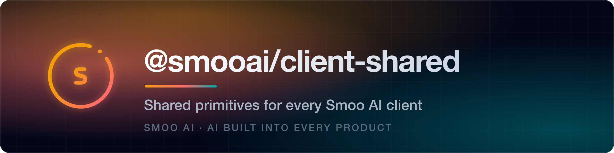
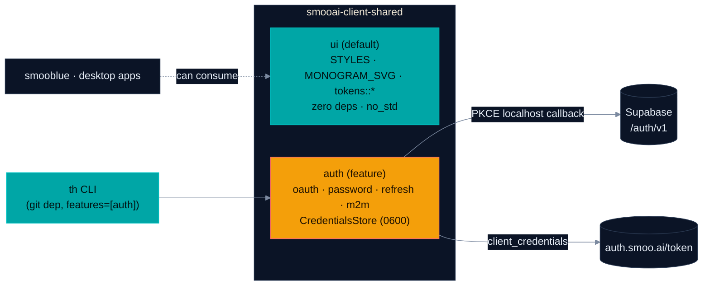

<p align="center">
  <a href="https://smoo.ai"></a>
</p>

<p align="center">
  <a href="https://smoo.ai/open-source"></a>
  <a href="./LICENSE"></a>
  <a href="https://github.com/SmooAI/smooth"></a>
</p>

<p align="center">
  
  
  
  
</p>

<p align="center">
  <a href="#what-is-this"><b>What it is</b></a> &nbsp;·&nbsp; <a href="#feature-tour"><b>Feature tour</b></a> &nbsp;·&nbsp; <a href="#quickstart"><b>Quickstart</b></a> &nbsp;·&nbsp; <a href="#honest-status"><b>Honest status</b></a> &nbsp;·&nbsp; <a href="#migrating-from-smooai-ui"><b>Migrating</b></a> &nbsp;·&nbsp; <a href="#-part-of-smoo-ai"><b>Platform</b></a>
</p>

---

> **Every Smoo AI Rust client needs the same three things — so they live in one crate.** Design tokens + the smoo monogram (`ui`), the full Supabase auth story — browser OAuth with PKCE, email+password, session refresh, M2M `client_credentials` — with a shared 0600 on-disk credential store (`auth`), One Rust crate, feature-gated so the bare `ui` build stays `no_std` with zero dependencies. Consumed in production by the [`th` CLI](https://github.com/SmooAI/smooth). **Rust-only today; not yet on crates.io** — npm / NuGet / PyPI siblings are planned, not built.

## What is this?

A Smoo AI Rust client (smooblue, observability-studio, `th`, `smoo admin`, …) typically needs the same three things:

1. **Design tokens + monogram** — so the UI looks like Smoo AI.
2. **Auth** — Supabase user OAuth (browser login), email+password, session refresh, AND M2M `client_credentials` grant (service accounts), with one shared on-disk `CredentialsStore`.
3. **LLM access** — exchanging a user session JWT for an org-scoped `llm.smoo.ai` bearer. *(Not built — there is deliberately no feature flag for it yet; see [Honest status](#honest-status).)*

Each of these has been re-implemented in every consumer at least once. This crate makes them one dependency. It absorbs the standalone [`SmooAI/ui`](https://github.com/SmooAI/ui) crate: `ui` is one module alongside `auth` — same constants, same paths. This repo's `shared/` is the **source of truth** for the design system; SmooAI/ui carries a copy, and a CI gate there fails if the two ever diverge.



---

## Feature tour

| | Capability | What you get |
| --- | --- | --- |
| 🔐 | [**Browser OAuth (PKCE)**](#-browser-oauth-pkce--localhost-callback) | Spawns a localhost callback, opens the browser, captures the Supabase session |
| 🔑 | [**Email + password grant**](#-email--password-grant) | Headless-friendly login — SSH, CI, Docker, no browser needed |
| ♻️ | [**Session refresh**](#-session-refresh) | `refresh_token` grant with rotation handling + a renew-ahead window |
| 🤖 | [**M2M `client_credentials`**](#-m2m-client_credentials) | RFC 6749 service-account grant against `auth.smoo.ai/token` |
| 💾 | [**`CredentialsStore`**](#-the-credentials-store) | One 0600 on-disk store for user + M2M sessions, side by side |
| 🎨 | [**Design tokens**](#-design-tokens-ui) | The `smooai-ui` surface, verbatim, as the `ui` module |

All snippets below are the actual API, verified against `rust/src/`.

### 🔐 Browser OAuth (PKCE + localhost callback)

The CLI login flow: generate a PKCE verifier/challenge, bind a random localhost port, open the browser to Supabase's authorize endpoint, capture the redirect, exchange the code for a session — and hand back `Credentials` ready to persist:

```rust
use smooai_client_shared::auth::{oauth::{login, OAuthConfig}, CredentialsStore};

let http = reqwest::Client::new();
let cfg = OAuthConfig::new("https://abcd1234.supabase.co", anon_key)
    .with_provider("google");

let creds = login(&http, &cfg).await?;      // opens the browser, waits ≤5 min
CredentialsStore::default_user()?.save(&creds)?;   // ~/.smooth/auth/smooai-user.json, mode 0600
```

> Prerequisite: `http://localhost` must be in the Supabase project's Redirect URLs allowlist, and PKCE enabled (GoTrue ≥ v2.95 default).

### 🔑 Email + password grant

No browser, no PKCE, no redirect-URL config — works over SSH, in CI, in containers. The password is held in memory only, never stored; MFA-enabled accounts fail with the upstream error verbatim:

```rust
use smooai_client_shared::auth::password::password_grant;

let creds = password_grant(&http, supabase_url, anon_key, "you@smoo.ai", &password).await?;
```

### ♻️ Session refresh

Supabase rotates refresh tokens on every exchange — the returned `Credentials` carries the **new** one and must be persisted, or the next refresh 400s. `should_refresh` reports the 5-minute-ahead window so long-running processes renew before a wire call fails:

```rust
use smooai_client_shared::auth::refresh::{refresh_session, should_refresh};

if should_refresh(&creds) {
    let fresh = refresh_session(&http, supabase_url, anon_key, &creds).await?;
    store.save(&fresh)?;   // MUST persist — the old refresh_token is now revoked
}
```

### 🤖 M2M `client_credentials`

RFC 6749 service-account grant: mint a `client_id`/`client_secret` in the Smoo web app, exchange for an org-scoped bearer at `https://auth.smoo.ai/token` (override with `SMOOAI_AUTH_URL` for staging):

```rust
use smooai_client_shared::auth::{m2m::client_credentials_grant, CredentialsStore};

// The token URL comes from token_url(): SMOOAI_AUTH_URL override, else auth.smoo.ai/token.
let creds = client_credentials_grant(&http, &client_id, &client_secret).await?;
CredentialsStore::default_m2m()?.save(&creds)?;    // ~/.smooth/auth/smooai.json
```

### 💾 The credentials store

Both flows share one on-disk shape. Two well-known files by convention — a single host carries a user session and an M2M session simultaneously without collision — written with **mode 0600**:

```rust
use smooai_client_shared::auth::{Credentials, CredentialsStore};

let store = CredentialsStore::default_user()?;   // or ::default_m2m(), or ::at(path)
if let Some(creds) = store.load()? {
    if creds.is_expired() { /* refresh or re-login */ }
}
```

### 🎨 Design tokens (`ui`)

The full `smooai-ui` surface, lifted verbatim — canonical OKLCH stylesheet, monogram, and token constants for non-DOM code paths. Zero dependencies, `no_std` when built with only the default `ui` feature:

```rust
use smooai_client_shared::ui::{STYLES, MONOGRAM_SVG, tokens};

let accent = tokens::SMOOAI_GREEN;   // "oklch(0.657 0.112 194.8)"
```

---

## Quickstart

**`smooai-client-shared` is not published to crates.io.** Consume it as a git dependency — this is exactly how the [`th` CLI](https://github.com/SmooAI/smooth) consumes it in production (rev-pinned, `features = ["auth"]`):

```toml
[dependencies]
smooai-client-shared = { git = "https://github.com/SmooAI/client-shared.git", features = ["auth"] }
```

### Feature flags

| Feature | Adds | Pulls | Status |
| --- | --- | --- | --- |
| `ui` (default) | `STYLES`, `MONOGRAM_SVG`, `tokens::*` | nothing — `no_std` | ✅ working |
| `auth` | Supabase OAuth + password + refresh, M2M, `CredentialsStore` | `tokio`, `reqwest`, `axum`, `serde`, … | ✅ working, 28 unit tests |

An `llm` feature (JWT → `llm.smoo.ai` org-session exchange, pearl th-f7b20f) is **planned and deliberately absent**. It previously existed as a flag over a six-line doc-comment module: `--features llm` compiled and produced nothing, which is worse than an honest gap. It returns when there is code behind it.

Run the tests yourself — 34 unit tests across `ui` + `auth` (OAuth callback/PKCE, token rotation, store round-trips, permission bits, token/CSS drift):

```bash
cd rust && cargo test --all-features
```

CI (`.github/workflows/rust.yml`) runs `cargo fmt --check`, `clippy --all-targets -D warnings` and the test suite in **both** feature configurations — the default `no_std` `ui` build and `--all-features` — plus a module-tree check that fails if any `.rs` file is unreachable from a `mod` declaration.

---

## Honest status

| Surface | Status |
| --- | --- |
| **Rust `ui`** | ✅ Working — the `tokens` constants are **generated** from `shared/tokens.json` at build time, and cross-checked against `shared/styles.css` in both directions (every token matches its custom property; every colour the CSS declares has a token) |
| **Rust `auth`** | ✅ Working — OAuth PKCE localhost-callback (387 LOC), password grant, refresh with rotation, M2M, 0600 `CredentialsStore`; 28 unit tests; consumed by the `th` CLI in production |
| **Rust `llm`** | ❌ Not built — no module, no feature flag. Pearl th-f7b20f tracks it |
| **crates.io** | ❌ Not published — git dependency is the only install path |
| **npm / NuGet / PyPI** | 📦 Planned, no code — the `src/`, `dotnet/`, `python/` directories in the layout below don't exist yet |

## Layout

```
client-shared/
├── shared/                # cross-language source of truth
│   ├── styles.css         # OKLCH tokens + base component CSS
│   ├── monogram.svg       # smoo monogram
│   ├── tokens.json        # THE token source — the Rust `tokens` module is generated from it
│   ├── tokens_codegen.rs  # generator, run from rust/build.rs
│   └── tokens_css_check.rs # asserts tokens.json <-> styles.css agree, both ways
└── rust/                  # smooai-client-shared (git dependency; crates.io planned)
    ├── Cargo.toml
    └── src/
        ├── lib.rs
        ├── ui/            # lifted verbatim from smooai-ui
        └── auth/          # oauth · password · refresh · m2m · storage  (feature = "auth")
```

npm (`src/`), NuGet (`dotnet/`), and PyPI (`python/`) packages are roadmap, not directories.

## Migrating from `smooai-ui`

Both crates are git dependencies (neither is on crates.io — there is no published shim). Migration is a source-level swap:

```toml
# before
smooai-ui = { git = "https://github.com/SmooAI/ui.git", branch = "main" }

# after — default features include "ui", same zero-dep no_std tree
smooai-client-shared = { git = "https://github.com/SmooAI/client-shared.git" }
```

```rust
// before
use smooai_ui::{STYLES, MONOGRAM_SVG, tokens};

// after — every const and sub-module at the same relative path under ui::
use smooai_client_shared::ui::{STYLES, MONOGRAM_SVG, tokens};
```

The `ui` module is API-compatible with `smooai-ui`: same constants, same paths, and the bare default build inherits the same dependency tree (none).

## Related repos

- [`SmooAI/ui`](https://github.com/SmooAI/ui) — the original design-system-only crate; [smooblue](https://github.com/SmooAI/smooblue) still consumes it directly. This repo carries the same `ui` surface for clients that also need `auth`.
- [`SmooAI/smooth`](https://github.com/SmooAI/smooth) — the `th` CLI; consumes `client-shared` (`features = ["auth"]`) for login + credential storage.
- `smooblue`, `observability-studio` — Dioxus desktop apps.

## 🧩 Part of Smoo AI

`@smooai/client-shared` is built and open-sourced by **[Smoo AI](https://smoo.ai)** — the AI-powered business platform with AI built into every product: CRM, customer support, campaigns, field service, observability, and developer tools.

- 🧰 **More open source from Smoo AI** — [smoo.ai/open-source](https://smoo.ai/open-source)
- 🧩 **Sibling repos** — [ui](https://github.com/SmooAI/ui) (the design-system-only crate), [smooth](https://github.com/SmooAI/smooth) (the `th` CLI), [@smooai/config](https://github.com/SmooAI/config), [@smooai/logger](https://github.com/SmooAI/logger)

## 🤝 Contributing

PRs welcome. `cd rust && cargo test --all-features` must pass; keep the bare `ui` build zero-dep and `no_std`, and gate anything heavier behind a feature flag.

## 📄 License

MIT — see [`LICENSE`](LICENSE).

---

<p align="center">
  Built by <a href="https://smoo.ai"><strong>Smoo AI</strong></a> — AI built into every product.
</p>
